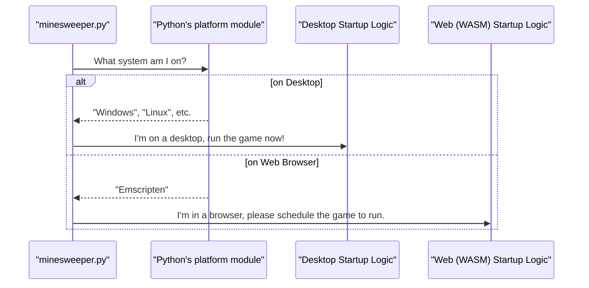

# Chapter 1: Desktop vs. Web (WASM) Adaptation

Welcome to the `minesweeper_pygame` tutorial! Over the next few chapters, we'll explore how this classic game is built using Python and the Pygame library.

Imagine you've just finished building a cool game on your computer. You can play it, and your friends can play it if they come over. But what if you want to share it with the world? The easiest way is to put it on a website where anyone can play it right in their browser, with no downloads required.

This project is special because it's designed to do exactly that. The same Python code can run as a normal application on your desktop (Windows, macOS, Linux) *and* as a game inside a web page. This chapter is all about how we achieve this magic trick.

### What is WebAssembly (WASM)?

Think of WebAssembly (or WASM for short) as a universal translator for code. Web browsers like Chrome and Firefox are really good at running a language called JavaScript. They don't normally understand Python.

WASM is a technology that allows us to take code written in languages like Python and "translate" it into a format the browser *can* understand and run very fast. This lets us use the power of Python and Pygame to create games that run on the web!

### The Challenge: One Code, Two Homes

Our game needs to live in two very different homes: the **desktop** and the **web browser**. While it's the same game, its environment changes, and it needs to adapt its behavior slightly.

*   **On the Desktop:** Our game is the star of the show. It creates its own window, and it has a lot of control. The user can resize the window, and the program runs until the user closes it.
*   **On the Web:** Our game is a guest in the browser's house. It lives inside a tab. The browser handles the main window, and our game needs to "play nice" with everything else the browser is doing.

This means we need a way for our code to ask, "Where am I right now?" and then act accordingly.

### The Platform Detector: Asking "Where Am I?"

Luckily, Python has a built-in tool that helps our code figure out where it's running. It's called the `platform` library. We use one simple `if` statement to check our surroundings.

```python
import platform

if platform.system() == "Emscripten":
    # I'm in a web browser! (Running via WASM)
else:
    # I'm on a regular desktop!
```

This is the most important trick in the whole file! When our Python code is converted to WASM using a tool called **Emscripten**, the `platform.system()` function returns the special name `"Emscripten"`. On your desktop, it would return something like `"Windows"` or `"Linux"`.

By checking for `"Emscripten"`, our code can instantly know if it's running on the web and change its behavior.

Let's see a diagram of this decision:



### How the Code Adapts

Our Minesweeper game makes two key adaptations based on this check.

#### 1. How the Game Starts

At the very end of `minesweeper.py`, you'll find the code that kicks everything off.

```python
# if wasm
if platform.system() == "Emscripten":
    asyncio.ensure_future(main(is_wasm=True))
else:
    # desktop
    if __name__ == "__main__":
        asyncio.run(main())
```

*   **Desktop (`else` block):** `asyncio.run(main())` is a direct command. It tells the computer, "Run the `main` game function right now and don't do anything else until it's done."
*   **Web (`if` block):** `asyncio.ensure_future(main(is_wasm=True))` is more like a polite request to the browser. It says, "Dear browser, please run my `main` game function whenever you have a chance." This is crucial for keeping the browser tab responsive.

Notice we also pass `is_wasm=True` to our `main` function. This is like putting a little "web mode" flag on our game so it remembers where it is.

#### 2. How the Window is Handled

Inside the game's `new_game` method, we create the game window. Here, too, we see our little flag being used.

```python
# From the new_game() method
if self.is_wasm:
    # For the web, set a fixed-size window
    self.screen = pygame.display.set_mode((WINDOW_SIZE, WINDOW_SIZE))
else:
    # For desktop, allow the window to be resized
    self.screen = pygame.display.set_mode((WINDOW_SIZE, WINDOW_SIZE), pygame.RESIZABLE)
```

*   **Web (`if self.is_wasm`):** We create a window with a fixed size. In a browser, it's easier to let the browser scale our fixed canvas than to try to manage window resizing from within the Python code.
*   **Desktop (`else`):** We create a `RESIZABLE` window. This gives the user the familiar desktop experience of clicking and dragging the window edges to make it bigger or smaller.

### Conclusion

You've just learned the foundational concept that makes `minesweeper_pygame` so flexible! By using a simple check, `platform.system() == "Emscripten"`, the code can adapt its startup process and window management to work perfectly on both desktop and the web. This small but powerful technique makes our project highly portable.

Now that we understand *how* the game environment is set up, we're ready to look at what the game actually does from moment to moment.

In the next chapter, we'll dive into the beating heart of our program: [The Main Game Loop (`update_loop`)](02_the_main_game_loop___update_loop___.md).

---

