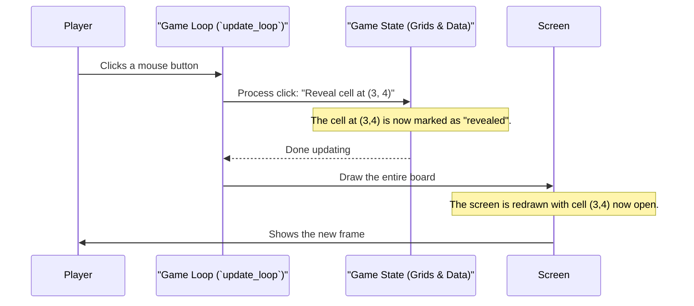

# Chapter 2: The Main Game Loop (`update_loop`)

In the [previous chapter](01_desktop_vs__web__wasm__adaptation_.md), we learned how our game cleverly adapts to run on both your desktop and in a web browser. Now, we're going to zoom in on the most important part of any interactive program: the game loop.

Think of a game like a movie or a flipbook. It's not one static picture; it's a series of pictures shown so quickly that they create the illusion of motion and interaction. The main game loop is the process that creates and displays each of these pictures, or "frames."

### The Heartbeat of the Game

The game loop is the engine that runs constantly while you're playing. Its job is simple but critical. In every single "tick" or cycle, it does three things in order:

1.  **Process Input:** It checks if you've done anything, like moving the mouse, clicking a button, or pressing a key.
2.  **Update State:** Based on your input, it changes the game's internal data. If you clicked on a cell, the game needs to remember that this cell is now "revealed."
3.  **Draw Screen:** It redraws the entire game screen to show the results of the changes. The newly revealed cell now appears open on the grid.

This `Input -> Update -> Draw` cycle repeats over and over, many times per second, which makes the game feel responsive and alive.

### A Polite Loop: Why `async` is a Superpower

Imagine you ask a friend to build a Lego model.
*   A **normal loop** is like a friend who locks themselves in a room and shouts, "Don't bother me until I'm completely finished!" They won't respond to anything else until the entire model is built.
*   An **`async` loop** is like a polite friend who says, "I'll work on this piece, but if I have to wait for the glue to dry, I'll let you know so you can do other things."

Our game loop is the second kind. The `async` keyword in Python turns our `update_loop` function into a "polite" one. This is **essential** for making our game work in a web browser.

If our game loop were the first kind, it would "lock" the browser tab. You wouldn't be able to scroll, click on other links, or switch tabs until you closed the game. By using `async`, our game loop can pause for a tiny fraction of a second between each frame, giving the browser a chance to breathe and handle its other jobs.

### The Master Conductor: The `main` Function

The `update_loop` function does the work for a *single frame*. Something needs to tell it to run again and again. That's the job of the `main` function.

Let's look at the simple `while` loop inside `main`:

```python
# From the main() function in minesweeper.py

async def main(is_wasm: bool = False):
    # ... setup code ...
    game = MinesweeperGame(is_wasm)

    while game.running:
        await game.update_loop()
        # Pause briefly to run at about 60 frames per second
        await asyncio.sleep(1.0 / FPS)
```

This is the entire engine!
1.  `while game.running:`: This says, "Keep doing this as long as the game hasn't been closed."
2.  `await game.update_loop()`: This tells our `game` object, "Please run one cycle of processing input, updating state, and drawing the screen." The `await` keyword is part of the `async` system.
3.  `await asyncio.sleep(...)`: This is the polite pause. We tell the program to wait for a tiny moment (e.g., 1/60th of a second). This is when the browser can do its other work, and it also controls our game's speed, or "Frames Per Second" (FPS).

### Inside a Single Frame: `update_loop` in Action

Now let's peek inside the `update_loop` and see the three steps.

#### Step 1: Processing Input

Pygame collects all user actions into a list of "events." Our first job is to check this list.

```python
# Inside the update_loop() method

for event in pygame.event.get():
    # If the user clicks the window's close button...
    if event.type == pygame.QUIT:
        self.running = False # Tell the main loop to stop
        return
```

This code loops through every event Pygame has recorded. Here, we check for a `pygame.QUIT` event, which happens when you click the 'X' on the window. If we see it, we set `self.running` to `False`, which will stop the `while` loop in `main`.

We also check for mouse clicks to see what the player wants to do.

```python
# Simplified from update_loop()

    if event.type == pygame.MOUSEBUTTONDOWN:
        # Check which button was clicked (1 is left, 3 is right)
        if event.button == 1:
            print("Player left-clicked!")
```

#### Step 2: Updating Game State

After detecting an input, we change the game's data. If the player left-clicks, we need to call the logic to reveal a cell.

```python
# Simplified from update_loop()

            # ... code to figure out which (row, col) was clicked ...
            
            # This is the state update!
            self.reveal_cell(row, col) 
```

We don't need to know *how* `reveal_cell` works right now, just that we call it to update the game's state. We'll explore this in detail in the [Cell Revealing Logic (`reveal_cell`)](07_cell_revealing_logic___reveal_cell___.md) chapter.

#### Step 3: Drawing the Screen

Finally, after all inputs for this frame have been handled and the state is updated, we need to show the results to the player.

```python
# At the very end of update_loop()

self.draw()
pygame.display.flip()
```

*   `self.draw()`: This is our custom function that draws the entire Minesweeper board based on the current game state. We'll dive into this in the [Rendering (`draw` method)](05_rendering___draw__method__.md) chapter.
*   `pygame.display.flip()`: This is the magic command. It takes the picture we just created with `self.draw()` and makes it visible on the screen. It "flips" the page of our flipbook to show the new frame.

### A Visual Summary

Here is a diagram showing what happens during one tick of our game loop when a player clicks a cell.



### Conclusion

You've just learned about the most fundamental concept in game programming! The main game loop is a simple but powerful cycle that makes our game interactive.

*   It runs continuously in a `while` loop.
*   Each cycle performs three steps: **Process Input**, **Update State**, and **Draw Screen**.
*   We use `async` and `await asyncio.sleep()` to make our loop "polite," which is crucial for running smoothly in a web browser without freezing the tab.

This loop doesn't hold the game's data itself; it just orchestrates the action. In the next chapter, we'll look at the object that *does* hold all the data: the [MinesweeperGame Class](03__minesweepergame__class__.md).

---

