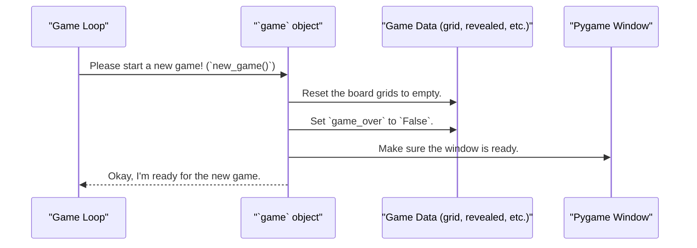

# Chapter 3: `MinesweeperGame` Class

In the [previous chapter](02_the_main_game_loop___update_loop___.md), we saw how the `update_loop` acts as the game's heartbeat, constantly processing input and drawing the screen. But the loop itself doesn't actually know how to play Minesweeper. It just calls the shots. So, who *does* know the rules?

Meet the `MinesweeperGame` class, the true brain of our operation.

### The Game's Director

Imagine you're making a movie. You have an engine (the camera) that runs and captures frames, which is like our game loop. But you also need a director who knows the story, keeps track of where all the actors are, and tells everyone what to do.

The `MinesweeperGame` class is our game's director. It is a single, all-knowing object that:

*   **Holds the Data:** It keeps track of the entire game board, the location of mines, which cells are revealed, and whether the game is over.
*   **Contains the Logic:** It holds all the instructions (or "methods") for how the game works, like starting a new game, revealing a cell, or drawing the board.

In Python, a `class` is like a blueprint for creating objects. The `MinesweeperGame` class is the blueprint, and when our game starts, we create one single object from this blueprint to manage everything.

### What's Inside the Director's Head?

Our `MinesweeperGame` class is organized into two main parts: its memories (data) and its skills (methods).

#### 1. The Data: What the Game Remembers

The director needs a script and notes to remember what's going on. Our class uses variables to store this information. These are often called "attributes" or "properties."

```python
# A simplified look at the data inside the class
class MinesweeperGame:
    # Game board data
    grid: list[list[int]]      # The main board with mine counts
    revealed: list[list[bool]] # Which cells are showing?
    flags: list[list[bool]]    # Where has the player placed flags?
    mines: set[tuple[int, int]]  # A set of (x, y) coordinates for mines

    # Game state flags
    game_over: bool
    won: bool
    running: bool
```

*   `grid`, `revealed`, `flags`: These are the grids that represent the game board. We'll explore these in detail in the [Game State Grids](04_game_state_grids_.md) chapter. For now, just know this is where the board data lives.
*   `game_over`, `won`, `running`: These are simple `True` or `False` flags that tell us the current status of the game.

#### 2. The Logic: What the Game Can Do

The director also needs to give commands. In a class, these commands are called "methods" (which are just functions that belong to a class).

```python
# A simplified look at the actions inside the class
class MinesweeperGame:
    # ... data from above ...

    def new_game(self):
        # Resets the board and starts a fresh game
        ...
    
    def reveal_cell(self, row: int, col: int):
        # The logic for what happens when you click a cell
        ...

    def draw(self):
        # The instructions for drawing the board on the screen
        ...
```

Whenever our main game loop needs something to happen, it asks our `game` object to do it. For example, when the loop detects a click, it calls `game.reveal_cell()`. When it's time to redraw the screen, it calls `game.draw()`.

### Creating Our Director: The `__init__` Method

So, how do we create this powerful object? In the `main` function, we do it with one simple line:

```python
# From the main() function in minesweeper.py
game = MinesweeperGame(is_wasm=True)
```

When this line runs, Python looks at the `MinesweeperGame` class blueprint and runs a special setup method called `__init__` (short for "initialize"). Think of this as the moment the director is hired and gets their notebook ready.

```python
# The __init__ method inside the MinesweeperGame class
def __init__(self, is_wasm: bool):
    pygame.init()
    self.is_wasm = is_wasm # Remember if we are on the web
    self.running = True
    
    # ... set other initial variables to default values ...

    self.new_game() # Get the board ready for the first time
```
The `__init__` method sets up some basic properties and then immediately calls `self.new_game()` to prepare the very first game board. The `self` keyword is how the director refers to themself, allowing them to access their own data and methods.

### How it Works: Starting a New Game

Let's see the director in action. What happens when the player finishes a game and clicks to play again? The game loop calls the `new_game()` method.

Here's a step-by-step breakdown:



The `new_game()` method is responsible for wiping the slate clean and resetting everything to its starting state.

Let's look at the code for it, simplified into small pieces.

First, it resets all the board data.

```python
# From the new_game() method
def new_game(self):
    # Create fresh, empty grids for the board state
    self.grid = [[0 for _ in range(GRID_SIZE)] for _ in range(GRID_SIZE)]
    self.revealed = [[False for _ in range(GRID_SIZE)] for _ in range(GRID_SIZE)]
    self.flags = [[False for _ in range(GRID_SIZE)] for _ in range(GRID_SIZE)]
```
This code creates new, clean data structures for the board, ensuring no information from the previous game is left over.

Next, it resets the game's status flags.

```python
# Continued from the new_game() method
    self.game_over = False
    self.won = False
    self.mines = set() # Clear the set of mines
```
This tells our program that the game is no longer over, the player hasn't won yet, and there are no mines on the board (they will be placed after the first click).

By centralizing all this logic in one method within one class, we make our code incredibly organized. If we ever need to change how a new game starts, we only have to look in this one place.

### Conclusion

You've now been formally introduced to the star of our program: the `MinesweeperGame` class. It's the central hub that connects everything.

*   It acts as a **director**, holding all the game's data (like the grids) and logic (like `reveal_cell`).
*   It's created from a `class` blueprint, and its special `__init__` method sets it up.
*   It keeps our code tidy by bundling related data and actions together. Any time we want to change the game's state, we ask our `game` object to do it for us.

We've mentioned that this class holds all the board data, but what does that data actually look like? In the next chapter, we will take a magnifying glass to the core data structures of our game.

Next up: [Game State Grids](04_game_state_grids_.md).

---

