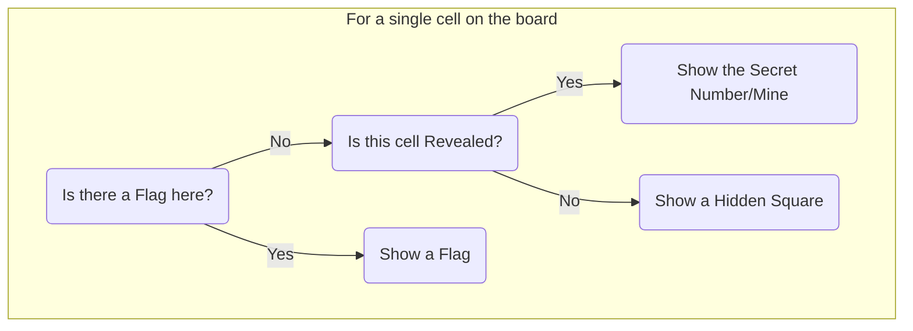
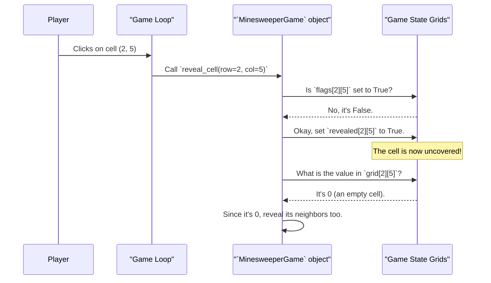

# Chapter 4: Game State Grids

In the [previous chapter](03__minesweepergame__class__.md), we met the `MinesweeperGame` class, our game's director. We learned that it holds all the game's data and logic. Now, we're going to open up the director's notebook and look at the most important data it keeps: the game board itself.

How do you represent a Minesweeper board in code? It's not just one board; it's a combination of what the player knows and what the game knows. Our project solves this with a clever system of "Game State Grids."

### The Board with Transparent Overlays

Imagine the Minesweeper board isn't a single flat surface. Instead, it's a stack of three transparent layers, like you might use on an overhead projector.

1.  **The Bottom Layer (`grid`):** This is the secret map. It's the "answer key" that knows where every single mine is hidden and what number should be in every empty square. The player never sees this layer directly.
2.  **The Middle Layer (`revealed`):** This layer is like a sheet of paper with holes cut out of it. It tracks which cells the player has uncovered. If a spot has a hole, you can see through to the secret map below. If not, it covers up the secret.
3.  **The Top Layer (`flags`):** This layer is for the player's notes. It's where they can place little "flag" stickers to mark where they *think* a mine is.

When the game needs to draw the board, it looks through all three layers from top to bottom for each cell to decide what to show.



### What is a 2D Array?

To create these layers, we use a programming structure called a **2D array**, which in Python is a **list of lists**. It's the perfect way to build a grid.

Imagine a simple tic-tac-toe board. You could represent it in Python like this:

```python
# A list containing three other lists (the rows)
tic_tac_toe_board = [
    ['X', 'O', ' '],  # Row 0
    [' ', 'X', ' '],  # Row 1
    ['O', ' ', 'X']   # Row 2
]
```

To get the middle cell, you'd ask for row 1, then column 1: `tic_tac_toe_board[1][1]`, which would give you `'X'`. Our Minesweeper grids work exactly the same way, just bigger!

### Layer 1: The Secret Map (`grid`)

This is the most important grid. It's created when a new game starts (specifically, after your first click). It holds integers, where each number has a special meaning:

*   **-1**: This means there is a mine in this cell.
*   **0**: This is a safe cell with no mines touching it.
*   **1-8**: This is a safe cell that is touching that many mines.

Here's how we create a grid full of zeros to start with. This happens in the `new_game` method.

```python
# Create a 10x10 grid filled with the number 0
self.grid = [[0 for _ in range(GRID_SIZE)] for _ in range(GRID_SIZE)]
```

This code might look a bit complex, but it's just a quick way of saying, "Create a list, and for each of the 10 spots in it, put another list of 10 zeros." After the `place_mines` method runs, this grid gets updated with the secret numbers and mines.

### Layer 2: The Reveal Overlay (`revealed`)

This grid is much simpler. It just needs to know if a cell is visible or not. For this, we use booleans: `True` or `False`.

*   `False`: The cell is hidden (default).
*   `True`: The player has clicked this cell, and it is now revealed.

Here's how we create the `revealed` grid, also in `new_game`. It starts out with every cell set to `False` because the player hasn't done anything yet.

```python
# Create a 10x10 grid filled with False
self.revealed = [[False for _ in range(GRID_SIZE)] for _ in range(GRID_SIZE)]
```

When a player clicks a cell at `(row, col)`, the code simply does this: `self.revealed[row][col] = True`.

### Layer 3: The Flag Overlay (`flags`)

This grid is almost identical to the `revealed` grid. It also uses `True` or `False` to remember where the player has placed a flag.

*   `False`: There is no flag on this cell (default).
*   `True`: The player has placed a flag here.

And just like the others, it's created as a grid full of `False` values.

```python
# Create a 10x10 grid filled with False
self.flags = [[False for _ in range(GRID_SIZE)] for _ in range(GRID_SIZE)]
```

If a player right-clicks a cell at `(row, col)`, the code flips the value: `self.flags[row][col] = not self.flags[row][col]`.

### How the Grids Work Together

Let's see this system in action. Imagine a player clicks on a cell at `(row=2, col=5)`. The game needs to figure out what to do.


This shows how the object first checks the `flags` grid. If there's no flag, it updates the `revealed` grid. Then it looks at the base `grid` to decide what to do next (like revealing more cells if it's a 0). We'll cover that logic in the [Cell Revealing Logic (`reveal_cell`)](07_cell_revealing_logic___reveal_cell___.md) chapter.

The most important takeaway is that **the game state is just data in these three lists**. All the game's logic is about reading from and writing to these grids.

### Conclusion

You've just learned the data-storage secret behind our Minesweeper game! By using three separate grids, we neatly separate the different parts of the game's state.

*   `grid`: The permanent "answer key" with all the mines and numbers.
*   `revealed`: A `True`/`False` overlay that shows what the player has uncovered.
*   `flags`: A `True`/`False` overlay that tracks where the player has placed markers.

This separation makes the rest of our code much easier to write. When we want to draw the board, we just need a function that can look at these three grids and decide what image to put on the screen for each cell. And that's exactly what we'll explore next.

Next up: [Rendering (`draw` method)](05_rendering___draw__method__.md).

---

