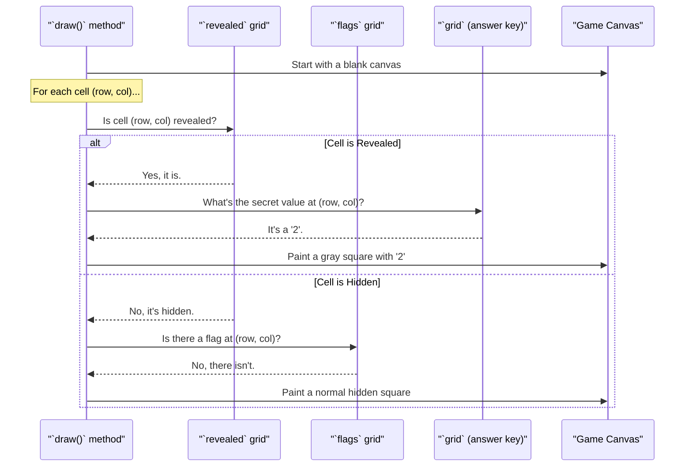

# Chapter 5: Rendering (`draw` method)

In the [previous chapter](04_game_state_grids_.md), we learned how our game stores its state using a clever system of three layered grids: `grid`, `revealed`, and `flags`. But that's all just data stored in the computer's memory. How does that data become the game you see on your screen?

This is where the `draw` method comes in. Think of the `draw` method as the game's dedicated artist. Once per frame, the [The Main Game Loop (`update_loop`)](02_the_main_game_loop___update_loop___.md) calls on this artist and says, "Take the current game state and paint me a picture!"

### The Artist's Process

Our artist's job is to translate the data from the grids into a visual representation. It does this by following a very specific, step-by-step process for every single cell on the board.

For each cell, the artist asks a series of questions to decide what to paint:

1.  **Is this cell revealed?** (It checks the `revealed` grid).
    *   **If YES:** The artist looks at the secret "answer key" (`grid`).
        *   Is it a mine (`-1`)? Paint an exploded red square.
        *   Is it a number (`1-8`)? Paint a gray square with the number inside.
        *   Is it a blank (`0`)? Paint an empty gray square.
    *   **If NO:** The cell is still hidden. The artist asks a second question.
2.  **Does this cell have a flag?** (It checks the `flags` grid).
    *   **If YES:** Paint a flag image.
    *   **If NO:** It's just a normal, hidden square. Paint a white, un-clicked square.

After going through every cell, the artist does one final check: Is the game over? If so, it paints a "Game Over" or "You Won!" message right on top of the board.

Let's see this decision-making process in a diagram.



### From Logic to Pixels: The Code

Now let's look at the actual code inside the `draw` method. We'll break it down into small, manageable pieces.

#### Step 1: Prepare the Canvas and Loop

First, the artist needs a blank canvas. Then, it sets up two loops to visit every single cell, one row at a time, and one column at a time.

```python
# Inside the draw() method
def draw(self):
    self.display.fill(WHITE) # Start with a blank white canvas

    for row in range(GRID_SIZE):
        for col in range(GRID_SIZE):
            # The decision logic for each cell will go here
            ...
```
The `for` loops ensure that our code will run for every cell from `(0,0)` to `(9,9)`.

#### Step 2: Draw Revealed Cells

This is the first question our artist asks: "Is this cell revealed?" If `self.revealed[row][col]` is `True`, this block of code runs.

```python
# Check if the cell at (row, col) is revealed
if self.revealed[row][col]:
    # It's revealed! Check if it's a mine.
    if self.grid[row][col] == -1:
        pygame.draw.rect(self.display, RED, rect) # Draw a red square
    else:
        # It's a safe cell.
        pygame.draw.rect(self.display, GRAY, rect) # Draw a gray square
        # If there's a number, draw it.
        if self.grid[row][col] > 0:
            # ... code to render the number text ...
```
Here, we see our logic in action. If the cell is revealed, we immediately check the `grid` (the answer key) to see *what* to draw: an exploded mine or a numbered square.

#### Step 3: Draw Flags or Hidden Cells

If the cell was *not* revealed, the code moves on to this `elif`/`else` block.

```python
# This runs if the cell is NOT revealed.
elif self.flags[row][col]:
    # It's not revealed, but it has a flag on it. Draw the flag.
    self.display.blit(self.flag, flag_rect)
else:
    # It's not revealed AND has no flag. It's a plain hidden square.
    pygame.draw.rect(self.display, WHITE, rect)
```
This perfectly follows our logic: first check for a flag, and if there isn't one, draw the default hidden square. `pygame.draw.rect` draws a simple rectangle, while `self.display.blit` copies an image (our flag) onto the canvas.

#### Step 4: Draw the Game Over Message

After the loops are finished and the entire grid is painted, we do one final check.

```python
# This runs AFTER the for loops have finished.
if self.game_over:
    # Prepare the message text
    text = self.font.render("Game Over!" if not self.won else "You Won!", True, BLACK)
    
    # Draw a blue box in the center of the screen
    pygame.draw.rect(self.display, BLUE, (100, 100, 200, 200))
    # Place the text on top of the box
    self.display.blit(text, (text_x, text_y)) # Coordinates are calculated to center it
```
This code only runs when the `self.game_over` flag is `True`. It draws a message box right on top of our finished grid.

#### Step 5: Show the Final Painting

Everything we've drawn so far has been on a hidden canvas called `self.display`. The very last step is to take this finished painting and make it visible in the game window, `self.screen`.

```python
# The final command in the draw() method
self.screen.blit(pygame.transform.scale(self.display, self.screen.get_size()), (0, 0))
```
This line might look a little complex, but it's doing something very cool. It takes our `display` (which is a fixed 400x400 pixels), scales it to whatever size the user's window currently is (`self.screen.get_size()`), and then copies it to the screen. This is what allows the desktop version of the game to be resizable!

### Conclusion

You now understand how the game world, which exists only as data in lists, is turned into the graphics you see and play with. The `draw` method is the bridge between data and visuals.

*   It acts as an **artist**, painting a picture of the game state every frame.
*   It systematically loops through **every cell** on the board.
*   For each cell, it uses `if/elif/else` logic to check the [Game State Grids](04_game_state_grids_.md) and decide what to draw.
*   It can draw game-wide messages, like "You Won!", on top of the board.
*   Finally, it scales the result to fit the window, making our game look good at any size.

We have the game state, and we have a way to draw it. Now, how does the player actually change that state? In the next chapter, we'll explore how the game listens for your clicks and touches.

Next up: [Adaptive User Input Handling](06_adaptive_user_input_handling_.md).

---

