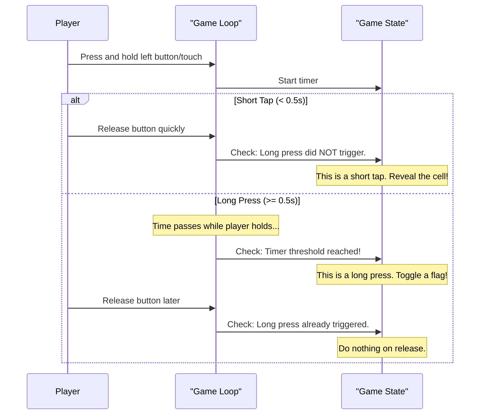

# Chapter 6: Adaptive User Input Handling

In the [previous chapter](05_rendering___draw__method__.md), we learned how the `draw` method acts as an artist, painting the game's data onto our screen. We know how to show the game board, but how does the player actually *play* the game? How do we tell the game which cell to reveal or flag?

This chapter is all about listening to the player. We'll explore the clever logic that interprets the player's actions, whether they're using a mouse on a desktop or a finger on a touchscreen.

### The Challenge: One Game, Two Kinds of Clicks

Imagine you're playing Minesweeper. You need to do two basic things:
1.  **Reveal** a square to see what's underneath.
2.  **Flag** a square where you suspect a mine is.

On a desktop computer, this is easy. A mouse has at least two buttons: a left-click for revealing and a right-click for flagging.

But what about a phone or a tablet? A touchscreen only has one kind of input: your finger tapping the screen. How can we tell the difference between a player wanting to reveal and a player wanting to flag? This is the core problem our input handling system needs to solve.

### The Solution: It's All About Timing!

Our game uses a very clever trick common in mobile apps: it uses a **timer** to understand the player's intent.

*   A **Short Tap** (pressing and releasing quickly) will mean **Reveal**.
*   A **Long Press** (pressing and holding your finger down for a moment) will mean **Flag**.

This way, we can support both actions with just a single touch input. Our code is "adaptive" because it adapts to the hardware it's running on, providing an intuitive experience for everyone.

### How It Works: Following a Click's Journey

All of our input logic is located inside the [The Main Game Loop (`update_loop`)](02_the_main_game_loop___update_loop___.md). Let's follow what happens step-by-step when a player interacts with the screen.

#### Step 1: The Press Down (`MOUSEBUTTONDOWN`)

The moment a player touches the screen or clicks a mouse button, Pygame sends a `MOUSEBUTTONDOWN` event. Our code's first job is to react to this.

If it's a **right-click** on a desktop, the answer is simple. We just toggle a flag.

```python
# Inside the update_loop()
if event.type == pygame.MOUSEBUTTONDOWN:
    # ...
    # This is for desktop users
    if event.button == 3: # 3 means right-click
        # Instantly toggle the flag on the cell
        self.flags[row][col] = not self.flags[row][col]
```
There's no ambiguity with a right-click, so we handle it immediately.

If it's a **left-click or a tap**, we don't act yet. Instead, we start a stopwatch and remember where the click happened.

```python
# Also inside MOUSEBUTTONDOWN
    if event.button == 1: # 1 means left-click or a screen tap
        # Start the timer!
        self.mouse_down_time = time.time()
        # Remember where they clicked
        self.mouse_down_pos = (col, row)
        self.long_press_triggered = False # Reset the long press tracker
```
We store the current time and the click position. `self.long_press_triggered` is a simple `False` flag we'll use to keep track of whether a long press has already happened.

#### Step 2: The Waiting Game (Checking for a Long Press)

Now, the player might be holding their finger down. Our game loop runs many times a second, and in every single frame, we check our stopwatch. This code runs *outside* the event-handling `for` loop.

```python
# This check happens every single frame
if self.mouse_down_time is not None and not self.long_press_triggered:
    
    # Check if 0.5 seconds have passed since the initial click
    if time.time() - self.mouse_down_time >= LONG_PRESS_THRESHOLD:
        # It's a long press! Toggle a flag.
        self.flags[row][col] = not self.flags[row][col]
        # Mark that we've already handled this press.
        self.long_press_triggered = True 
```
If the click started (`mouse_down_time` is not `None`) and 0.5 seconds have passed, we perform the "flag" action. Crucially, we set `long_press_triggered` to `True` so we don't keep adding flags every frame if the user continues to hold.

#### Step 3: The Release (`MOUSEBUTTONUP`)

Finally, the player lifts their finger or releases the mouse button. This triggers a `MOUSEBUTTONUP` event. Now we make our final decision.

```python
# Inside the update_loop()
elif event.type == pygame.MOUSEBUTTONUP:
    # Was this the end of a left-click/tap?
    if event.button == 1 and self.mouse_down_time is not None:
        
        # Did a long press NOT happen?
        if not self.long_press_triggered:
            # If not, it must have been a short tap! Reveal the cell.
            self.reveal_cell(row, col)
        
        # Reset the timer for the next click
        self.mouse_down_time = None
```
When the button is released, we check one thing: did a long press already get triggered?
*   If `long_press_triggered` is `False`, it means the player released the button *before* the 0.5-second timer was up. This was a **short tap**, so we call `reveal_cell()`.
*   If `long_press_triggered` is `True`, we do nothing, because the **long press** action (flagging) was already taken care of.

### A Visual Summary

This flow of logic can be visualized to see the two different paths a single touch can take.



### Conclusion

You've just learned how our game cleverly listens to the player and adapts to their device. This is a fantastic example of user-friendly design in programming.

*   We handle **desktop** and **touch** input with the same code.
*   A classic **left-click/right-click** system works for mouse users.
*   A **timer** allows us to distinguish between a **short tap (reveal)** and a **long press (flag)** for touch users.
*   This logic works by starting a timer on `MOUSEBUTTONDOWN`, continuously checking it, and making a final decision on `MOUSEBUTTONUP`.

This whole chapter was about understanding *what* the player wants to do. In the next chapter, we'll dive into the consequences of that action and explore the most exciting piece of Minesweeper logic: what happens when a cell is revealed.

Next up: [Cell Revealing Logic (`reveal_cell`)](07_cell_revealing_logic___reveal_cell___.md).

---

