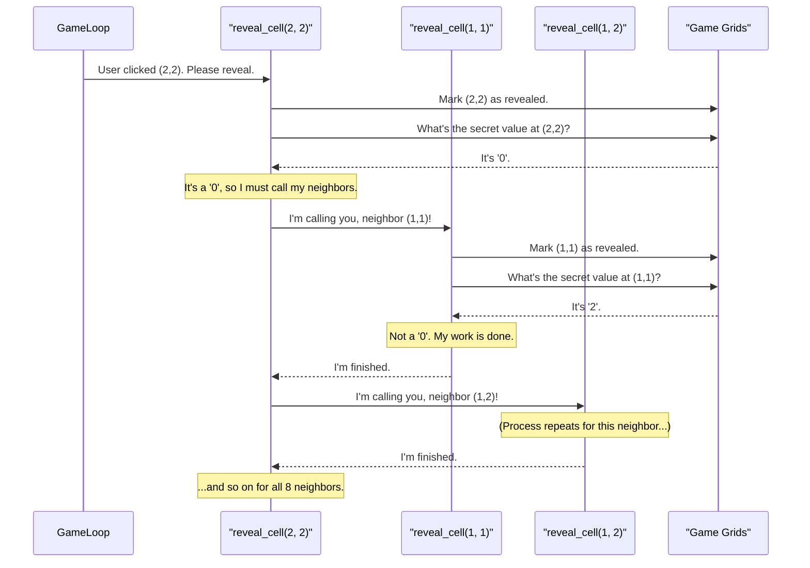

# Chapter 7: Cell Revealing Logic (`reveal_cell`)

In the [previous chapter](06_adaptive_user_input_handling_.md), we mastered how the game listens to the player's clicks and touches. We know that a short tap is meant to reveal a cell. But what happens next? When you click on a cell in Minesweeper, you're not just revealing one square; sometimes, you're setting off a huge, satisfying chain reaction that clears out a whole patch of the board.

This chapter is about that magic moment. We'll dive into the `reveal_cell` function, which contains one of the game's core mechanics and is a perfect example of a powerful programming concept called **recursion**.

### The Magic of Recursion: The Domino Effect

Imagine you have a line of dominos. You tip over the first one, and it tips over the next, which tips over the one after that, and so on. You only started one action, but it created a chain reaction.

Recursion in programming is very similar. It's the idea of a function that calls *itself* to solve a smaller part of the same problem.

In Minesweeper, the `reveal_cell` function works like this:
1.  **Reveal this cell.**
2.  **Ask a question:** Is this an empty cell (a '0')?
3.  **If yes:** Tell all of its 8 neighbors to do the exact same thing (i.e., call `reveal_cell` on themselves).

This creates the "domino effect" that clears large empty areas. A neighbor that gets called also reveals itself, checks if it's a '0', and if so, tells *its* neighbors to do the same. The process spreads like a wave until it hits cells with numbers, which act as a wall and stop the chain reaction.

### Under the Hood: The `reveal_cell` Method

Let's trace what happens when you click an empty cell at `(row=2, col=2)` which happens to have a value of `0`.



The function `reveal_cell` calls itself for each of its neighbors, creating the spreading effect. The chain stops when a called function finds a number (like '2') or a mine, because those cells don't call their own neighbors.

### A Step-by-Step Code Walkthrough

The entire `reveal_cell` function is surprisingly small. Let's break it down into its three logical parts. The function is part of our `MinesweeperGame` class.

#### Part 1: The "Don't Bother" Rules

Before a domino can fall, we have to make sure it's standing up and in the line. Our function first checks if it should even bother doing anything. These are the "base cases" that stop the recursion.

```python
# From the reveal_cell method in minesweeper.py

def reveal_cell(self, row: int, col: int) -> None:
    # Stop if we are outside the board, or the cell is already revealed, or it's flagged.
    if row < 0 or row >= GRID_SIZE or col < 0 or col >= GRID_SIZE or self.revealed[row][col] or self.flags[row][col]:
        return
```
This single `if` statement is our bouncer at the door. It says:
*   "Is the `(row, col)` you're asking about even on the board? If not, stop."
*   "Has this cell already been revealed? If yes, stop."
*   "Has the player put a flag here? If yes, stop." (You can't reveal a flagged cell.)

If any of these are true, the `return` command exits the function immediately, preventing an infinite loop and respecting the player's flags.

#### Part 2: The Main Action

If the function passes the safety checks, its first job is simple: update the [Game State Grids](04_game_state_grids_.md) to mark this cell as revealed.

```python
# Continued from the reveal_cell method...

    self.revealed[row][col] = True
    if self.grid[row][col] == -1:
        return # We hit a mine, stop here.
```
This is the core action. We set the value in our `revealed` grid to `True`. We also add a quick check: if we just revealed a mine (`-1`), we should stop right away. The main game loop will handle the "game over" logic.

#### Part 3: The Chain Reaction

This is the recursive magic. If the cell we just revealed is an empty '0', we need to tell all of its neighbors to reveal themselves.

```python
# The final part of the reveal_cell method...

    if self.grid[row][col] == 0:
        for dr in [-1, 0, 1]:
            for dc in [-1, 0, 1]:
                if dr == 0 and dc == 0:
                    continue
                # This is the recursive call!
                self.reveal_cell(row + dr, col + dc)
```
This is the domino push!
1.  It checks if the current cell's value is `0`.
2.  If it is, it uses two `for` loops to visit all 8 neighbors (`dr` and `dc` represent the change in row and column).
3.  For each neighbor, it calls `self.reveal_cell()` again, but with the neighbor's coordinates.

And that's it! The entire beautiful, cascading reveal is handled by this small, elegant piece of code.

### Conclusion

You've just untangled one of the most clever and important algorithms in Minesweeper! The `reveal_cell` function shows the power of recursion.

*   **Recursion** is a technique where a function calls itself to solve smaller, similar problems.
*   We use it to create the satisfying **chain reaction** when an empty area is clicked.
*   The process needs **base cases** (our "Don't Bother" rules) to know when to stop, preventing infinite loops.
*   The logic is simple: reveal yourself, and if you're a '0', tell all your neighbors to do the same.

Our journey through the core logic of `minesweeper_pygame` is now complete. We've seen how the game starts, how it runs in a loop, how it stores its data, how it draws the screen, how it handles input, and how it reveals cells.

In the final chapter, we'll look at a practical utility that helps us package our game for the web.

Next up: [Web Asset Bundler (`build-code-zip.py`)](08_web_asset_bundler___build_code_zip_py___.md).

---

