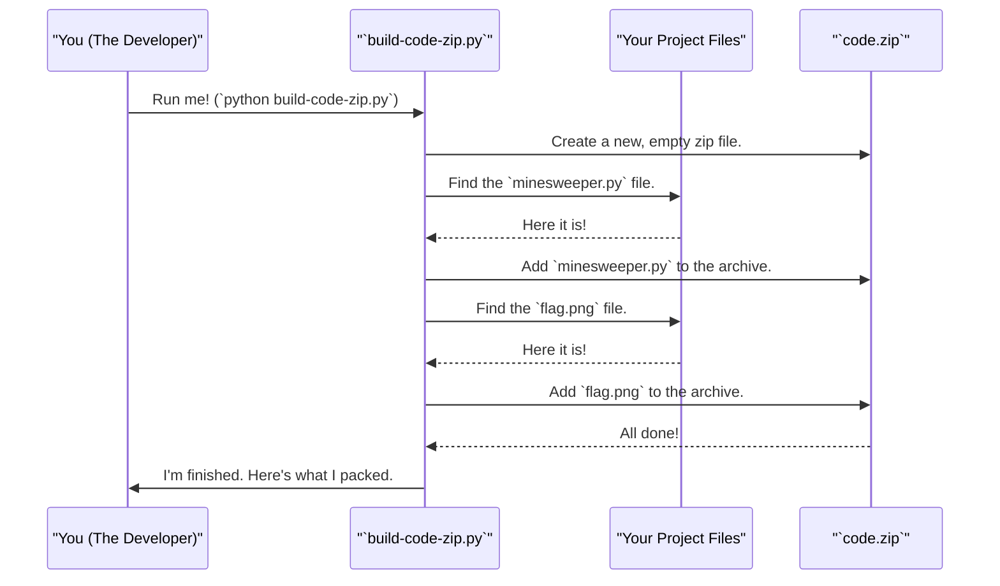

# Chapter 8: Web Asset Bundler (`build-code-zip.py`)

In the [previous chapter](07_cell_revealing_logic___reveal_cell___.md), we explored the powerful recursive logic in the `reveal_cell` method that makes playing Minesweeper so satisfying. We have now covered every piece of the game's core logic, from starting up to playing the game.

But there's one last, crucial step. Our game works beautifully on our computer, but how do we get it to the web? The code and images are currently separate files. A web browser can't easily fetch all of them one by one. We need a way to package our entire game into a single, neat bundle that can be easily "shipped" to the player's browser.

This is where our final utility script, `build-code-zip.py`, comes in.

### The Problem: Shipping Your Game to the Web

Imagine you want to mail a friend a gift that has several parts: a toy car, its remote control, and a set of batteries. You wouldn't just put a stamp on each individual item and drop them in the mailbox. They would get separated and lost. Instead, you'd put them all together in a single box, seal it, and then mail the box.

Our game is the same. It has several parts:
*   The main Python script: `minesweeper.py`
*   The flag image: `flag.png`

To send our game to a player's browser, we need a "packer" to put all these pieces into a single "box." The `build-code-zip.py` script is our packer, and the box it creates is a file named `code.zip`.

### The Solution: A Helper Script

`build-code-zip.py` is not part of the game itself. You don't run it to play Minesweeper. Instead, it's a tool for you, the developer. Its one and only job is to find all the necessary game files and compress them into a single `code.zip` archive.

The web page that hosts our game is already set up to look for this exact file. When you load the page, it downloads `code.zip`, opens it up, and finds everything it needs to run your Minesweeper game inside.

### How to Use the Bundler

Running this script is very simple. You just open a terminal or command prompt in the project's main folder and run the following command:

```bash
python build-code-zip.py
```

When you run it, you will see output that looks like this:

```
Files included in code.zip:
  - minesweeper.py
  - flag.png
```

After the script finishes, you will see a new file in your project folder: `code.zip`. This file is the complete, portable package of your game, ready to be uploaded to a web server.

### What's Happening Under the Hood?

Let's look inside our "packer's" instruction manual to see how it works. The process is simple: find the specific files we need and add them to a zip archive.

Here's a diagram of the workflow:



### A Peek at the Code

The Python code that performs this magic is short and easy to understand. Let's look at the key parts.

First, we need to import the tools Python gives us for handling files and zip archives.

```python
import zipfile
from pathlib import Path
```
*   `zipfile` is Python's built-in library for creating and reading zip files.
*   `pathlib` is a modern library that makes it easier to work with file and folder paths.

Next, we open our "box"—the `code.zip` file—and get it ready to be filled. The `with` statement ensures the file is properly saved and closed when we're done.

```python
# Create a new zip file in "write" mode
with zipfile.ZipFile('code.zip', 'w', zipfile.ZIP_DEFLATED) as zf:
    # ... code to add files goes here ...
```

Now, inside that `with` block, we create a list of files to search for. We then loop through that list, find each file, and add it to our zip archive.

```python
    # A list of files to search for
    files_to_find = ['minesweeper.py', 'flag.png']

    for file_pattern in files_to_find:
        # Search for the file
        for file_path in Path('.').rglob(file_pattern):
            # Add the found file to the zip archive
            zf.write(file_path)
```
The `Path('.').rglob(file_pattern)` command is a powerful search tool. It says, "Starting in the current directory (`.`), search recursively (`r`) through all subfolders to find any files that match this pattern (`glob`)." `zf.write()` is the command that actually places the file into the zip.

And that's it! This simple script automates the process of packaging your game, making sure you never forget to include a necessary file when you want to deploy a new version to the web.

### Conclusion

Congratulations! You have completed the tour of the `minesweeper_pygame` project. You've learned how the game adapts to run on both **desktop and the web**, how its **main loop** keeps it alive, how the **`MinesweeperGame` class** organizes the logic, and how the game's state is managed with **data grids**. You've seen how the game **renders graphics**, handles **adaptive user input**, and implements the recursive **cell-revealing logic**.

Finally, you've learned about the `build-code-zip.py` utility, a practical tool that bundles your project's assets into a single package for easy web deployment. This final step bridges the gap between writing code on your computer and sharing your creation with the world.

You now have a complete, high-level understanding of how a portable, cross-platform game can be built in Python. We hope this journey has been insightful and encourages you to explore, modify, and build your own projects! Happy coding

---

