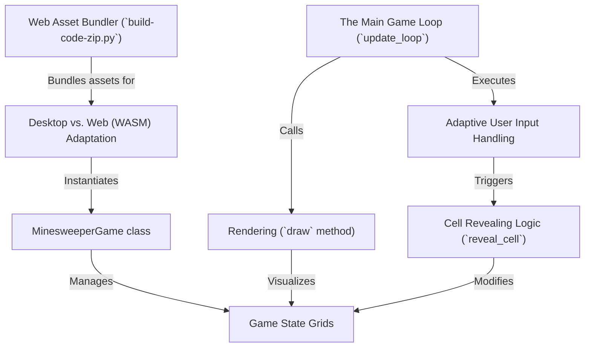

# Tutorial: minesweeper_pygame

This project is a classic implementation of the **Minesweeper** game using the *Pygame* library. Its special design allows it to run not only as a standard desktop application but also directly in a *web browser*. The game features an adaptive control scheme, recognizing left/right clicks on desktop and distinguishing between *short taps* and *long presses* for touch devices to reveal or flag cells.

**Source Repository:** [https://github.com/fancellu/minesweeper_pygame](https://github.com/fancellu/minesweeper_pygame)

## Chapters

1. [Desktop vs. Web (WASM) Adaptation
](01_desktop_vs__web__wasm__adaptation_.md)
2. [The Main Game Loop (`update_loop`)
](02_the_main_game_loop___update_loop___.md)
3. [`MinesweeperGame` Class
](03__minesweepergame__class_.md)
4. [Game State Grids
](04_game_state_grids_.md)
5. [Rendering (`draw` method)
](05_rendering___draw__method__.md)
6. [Adaptive User Input Handling
](06_adaptive_user_input_handling_.md)
7. [Cell Revealing Logic (`reveal_cell`)
](07_cell_revealing_logic___reveal_cell___.md)
8. [Web Asset Bundler (`build-code-zip.py`)
](08_web_asset_bundler___build_code_zip_py___.md)

---

